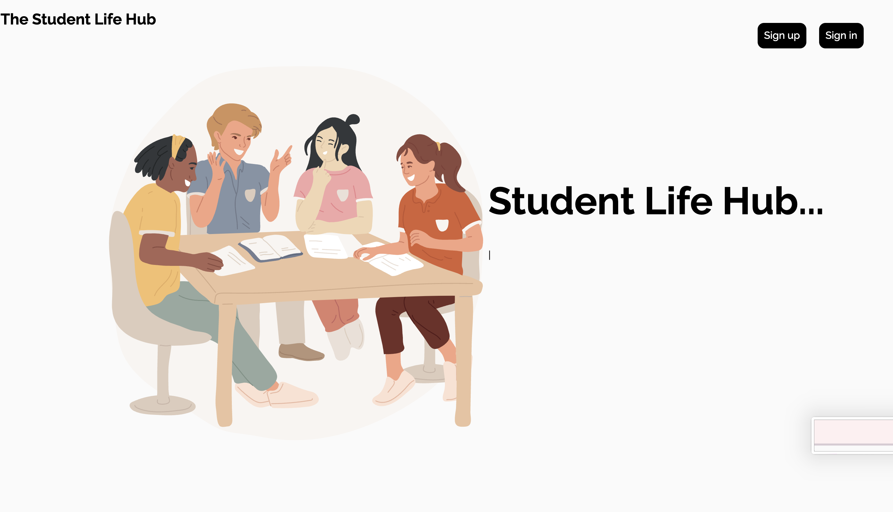

<h2>
    🖋️ THE STUDENT LIFE HUB 📑
</h2>

<a href="https://www.linkedin.com/in/gabtongol128/">by Gabrielle Tongol</a>

The Student Life Hub is a comprehensive application designed to help you stay organized and on top of your academic life. With this app, you can effortlessly track your tasks and assignments, monitor your grades, and manage your expenses

## 📝 FEATURES

- The Student Life Hub enables users to add subjects and assignments, including details like descriptions, links, grades, and progress tracking.
- Users can easily edit or delete assignment details as needed.
- The Subject Grades page allows users to view their calculated grade average (note: this is an estimate and not the official final grade).
- Users can also track their expenses, with the app automatically calculating the total amount.

## 📝 SCREENSHOTS

## 📝 TECHNOLOGIES USED

	<code></code>
	<code></code>
	<code></code>
	<code></code>
	<code></code>

 

For Animations

- [Animate.style](https://animate.style/)
- [Typing Animation](https://github.com/mattboldt/typed.js)

## 📝 GETTING STARTED

Here is the link for the project planning in trello: https://trello.com/invite/b/66aab2f66ebefc30ca829212/ATTIfdddf8e4173ccef40a66ae5fefbd8299B0D74031/student-life-app

Link to the website:
https://student-life-hub-455ca3e2f1cb.herokuapp.com/

## 📝 FUTURE PLANS

- A link where the user can see their own profile, which will also allow them to edit their personal information and add profile pictures.
- Email and password validator
- A built in pomodoro timer
- Fix the assignment cards spacing
- Allow the user to drag and drop assignment card's position
- Have a sort button which allows the user to display sorted assignments and expenses based on specific requirements
- Have a search bar which allows user to search assignments and expenses
- View expenses depending on month
- Dark mode 

